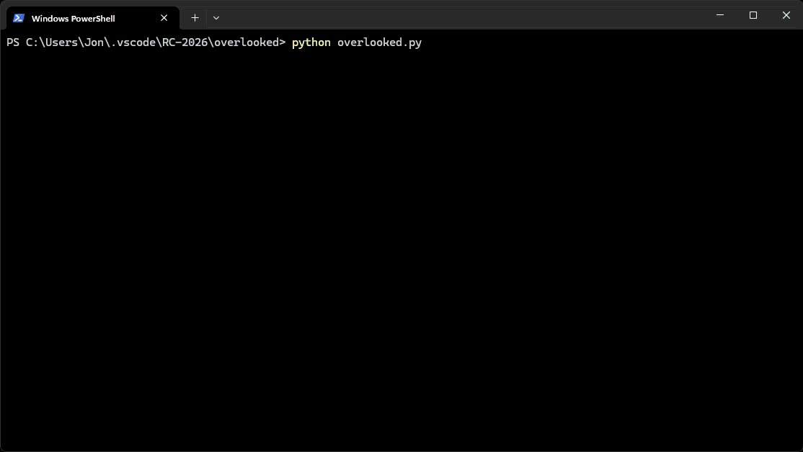

# Overlooked (by Jon King) - terminal ant

<i>```A lone ant’s wayward journey home, unaware that a giant eye was tracking its every step.```</i>

A fun, self-guided terminal exploration written from scratch without external frameworks.

---

## Instructions
* "Please link to a program you've written from scratch."
* "it should be something you've written yourself"
* "not using a framework"
---

## Run it

```
python overlooked.py
```

Requires **Python 3.6+** and **Windows**. Key input uses `user32.GetAsyncKeyState`, so for now, not cross-platform without a significant rewrite.

| Key | Does |
|---|---|
| `↑ ↓ ← →` | Move the ant. You can't go backwards into your own neck. |
| `` ` `` | Toggle debug mode. Draws segment index when drawing each glyph. |
| `Esc` | Quit. |



## Inspiration
One of the suggestions: "Choose your favorite poem and let it inspire what you make"

In 11th grade English class, I took American and British Romanticism. I found inspiration from a memory from that class tied to a poem I wrote. (I don't know which author or poet this was related to unfortunately.)

My teacher took us to a Japanese Garden. We drank green tea, meditated, and let our thoughts go, untethered. I found myself captivated by the journey of a lone ant. I wrote a poem called 'Overlooked' about that ant’s wayward journey home, unaware that a giant eye was tracking its every step.

---

## Requirements (RC + mine)

1. no frameworks (assuming no ease of use libraries like numpy/pandas, only necessities like system/os/etc) 
2. hand-coded
3. simple experience where you are the ant
4. command line output - Ascii/ANSI/Unicode
5. render in place
6. characters that represent the ant
7. (try) one character for the head, one for segments (with legs).

---

## My technical spec

1. Some kind of draw-update loop in the main thread
2. monitor keypress (if needed, in a separate thread)
3. exit the loop and program if esc is pressed
4. display a rectangle grid
5. track a current position and orientation array (4 positions -> head + 3 segments with legs). Using a ring buffer of combined [pos0, pos1, pos2, pos3] (pos, orientation). Originally positions and orientations were tuples, but adding and flipping were difficult, so made a vector class (I had to look up how to do classes and constructors in python)
6. render a 0 at the first pos, 1 at second , 2 third, 3 fourth. Eventually body glyphs
7. when up/left/down/right presses a button, looks in that direction from the head. if opposite the current head direction, cannot go there. if that position is out of bounds, cannot go there. if a segment of the body is in that direction (ignoring the last because it will move), cannot go there. if empty space (or final segment), can go there and inserts the new position and direction at the front of the array and overwrites the last.
8. if threading and the data structure doesn't work - lock or atomic operation to update the arrays and read them together. (sounds like it should be a multiple dimensional vector/matrix like np but framework-less ... list of tuples

---

## Decisions

* Single threaded with sleep (polling for keys)
* Windows API (Sorry! not cross platform)
* Grid that looked close to golden ratio proportions (20 wide by 5 tall. with (1 char border AND 1 char extra ~padding) on each side
* decided not to use diacritics
  - initially tried diacritics ">o ǒ o< o̭" AND ":o ö o: o̤", for head, BUT lower circumflex/breve/diaeresis marks misaligned in my terminal font.
* Head Graphics: Settled on (`ᗢ`, `ᗣ`, `ᗤ`, `ᗧ`) from Unicode Block `1400–167F`.
* Body/Leg Graphics: Tested multiple options before settling on (`Ω`, `Ʊ`, `ᘳ`, `𝈀`) for consistent rotation symmetry.

---

## Sources

* time.sleep (https://docs.python.org/3/library/time.html#time.sleep)
* moving the cursor (escape codes)
* capturing keydown, keyup, keypress etc in python. (ultimately decided to use the Windows API - SORRY not cross platform)
  - (https://stackoverflow.com/questions/64629200/user32-getasynckeystate-on-python-to-capture-keys-and-mouseclicks) and more like this
* ctypes (https://docs.python.org/3/library/ctypes.html)
  - GetAsyncKeyState (https://learn.microsoft.com/en-us/windows/win32/api/winuser/nf-winuser-getasynckeystate)
  - virtual key codes (https://learn.microsoft.com/en-us/windows/win32/inputdev/virtual-key-codes)
  - bitmask for only caring if it is down right now (https://stackoverflow.com/questions/64901061/what-is-the-difference-between-using-getasynckeystate-by-checking-with-its-ret)
* characters (https://shapecatcher.com/)
* diacritics (https://www.lexilogos.com/keyboard/diacritics.htm and other similar sites)
* python class-related stuff
  - classes (https://www.w3schools.com/python/python_classes.asp)
  - constructors (https://typing.python.org/en/latest/spec/constructors.html)
  - properties, extending, ultimately used the @dataclass (https://docs.python.org/3/library/dataclasses.html)
  - namedtuple vs dataclass (frozen=true to make it easily usable in a dictionary.) honestly, still not sure what is right - downsides to both that I'm still learning. I probably would have used numpy for this if I didn't have the no ~frameworks constraint

#### FUN: gained awareness of Canadian Aboriginal Syllables
* Really cool! (used for the head)
  - Unicode Block 1400-167F
  - https://shapecatcher.com/unicode/block/Unified_Canadian_Aboriginal_Syllabics
  - https://en.wikipedia.org/wiki/Canadian_Aboriginal_syllabics
  - https://allthingslinguistic.com/post/160962768612/canadian-aboriginal-syllabics-is-a-writing-system (amazing graphic, in folder)


#### AI usage disclaimer
- My workflows have been moving toward leveraging AI more, and keeping it to the 'correct amount' here was an active, ongoing push
  - **NOTE** all code was typed by me
- (multiple) reference docs
  - using Google AI / Claude / Gemini has become intertwined into my doc lookup and internalization
- (Google AI) data class / mods
  - discussed non-framework options for Vector2D
  - decided to make my own and use a NamedTuple
- (Claude) character selection discussion
  - ```ᗢᗣᗤᗧ``` head glyphs found via chat (further head glyph exploration but came back to ```ᗢᗣᗤᗧ```)
  - **NOTE:** body glyphs found by me, using shapecatcher — drew the symbols and iterated through Unicode code blocks by hand
- (Claude) Key-down/masking: discussed ctypes interop
  - I've always had to look up system-library interop and AI is now the faster lookup path
  - debugged issue in my GetAsyncKeyState and typing and to understand why I needed ```(ctypes.c_int,)``` or ```[ctypes.c_int]``` and why ```(ctypes.c_int)``` didn't work
- (Gemini + Claude) code/comment review - specifically to see if my code and comments were clear
  - Gemini tried to rewrite comments, change my architecture, and fix the bugs I noted (I was not a fan)
  - Claude recommended a section for how to run, to expand my cross platform info with requirements, and also suggested a gif since it was limited to Windows-only. Additionally, recommended a ring-buffer diagram for clarity -- I modified that to make it my own ~visualization of the ring buffer in the move_one_step doc string.
---

## KNOWN BUGS 𝈀𝈀𝈀ᗧ

- [x] ~~doesn't draw the ant at the start~~
- [x] ~~can go 1 line too low. can't reach top line~~
- [ ] debug mode never draws more than 0 and 1 (cause only redrawing head, segment 1, tail) should also draw segment 2 and 3. To consider -- this is because the debug draws like the standard draw = only the head and next segment and erases the tail. If I want an alternate style, I should probably have 2 modes (drawAll vs drawMinimum) and the debug output should reflect the mode.

---

## Thoughts

* maybe encapsulate pos and orientation into Pose and make a class like AntState to wrap the global circular buffer `_pos` and `_head_pointer` into a dedicated class. would cleans up global state usage (`global _running, _head_pointer`) inside `main()` and `update()`.
  - Pos + Loc => needs a composite name. class would be good too. Searching yielded: Pose (technically a 2D Pose) or Special Euclidean group 2 "SE(2)". I think Pose
* **Observation:** reminds me of snake, falldown
* **Observation:** there is no home to journey to. There was none to be seen when I observed the ant, either. Just noting because I wrote "A lone ant’s wayward journey home"